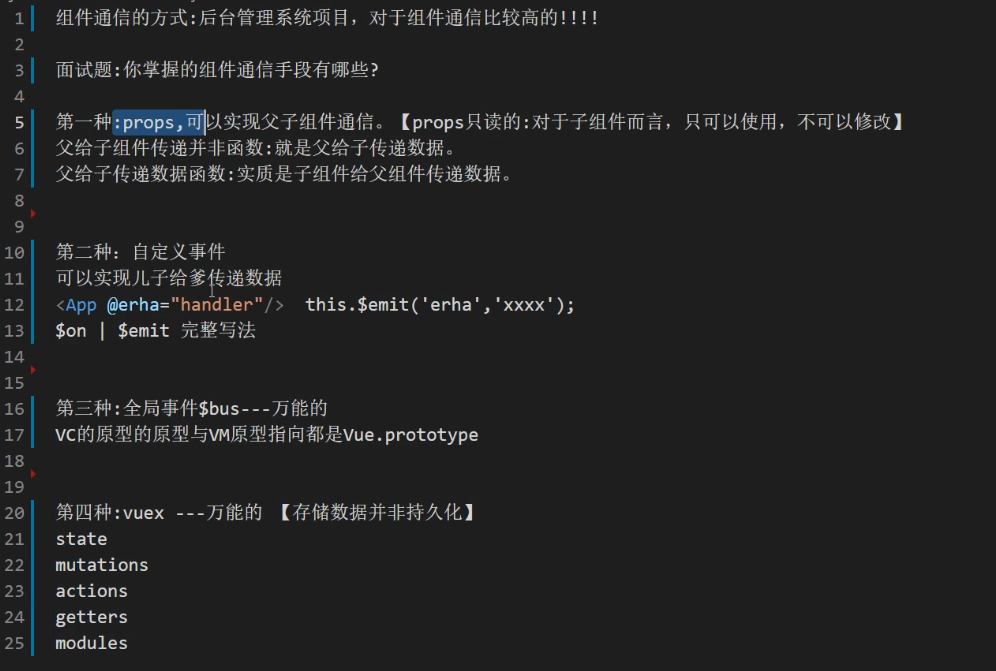
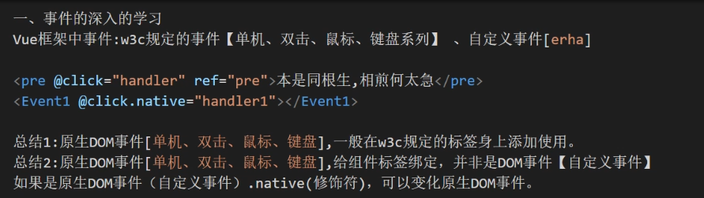
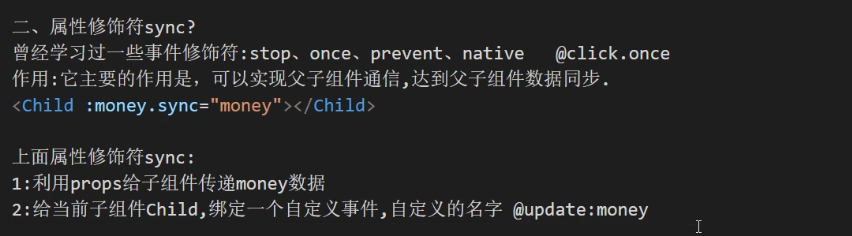
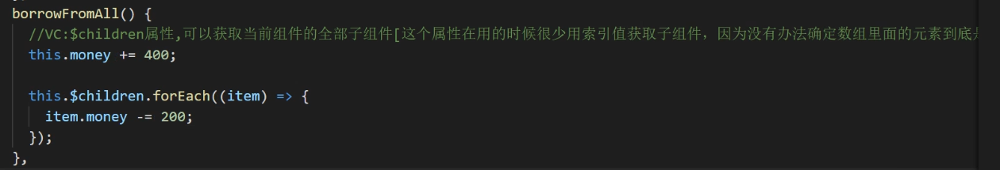
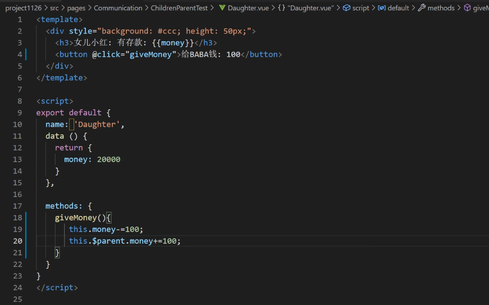

大总结:组件标签---自定义标签
组件标签@xxxx,都是自定义事件.出现修饰符.native才有可能是原生DOM事件!!!!

二、v-model深入学习v-model指令:一般与表单元素一起使用[input],可以达到数据双向绑定，收集表单数据。v-model:能直接修改vuex仓库中的数据吗?
面试的时候:经常会问v-model底层实现原理?*****V-model[Vue2]:value与input事件完美结合。

1.5v-model
作用:可以实现父子组件通信,达到父子组件数据同步。v-model底层原理[vue2]: value与input事件

三、VC的$attrs与slisteners属性.父子组件通信
vc,$attrs,可以获取父组件传递过来的属性[props]，如果props接受,子组件$attrs获取不到!!!vc,$listeners,可与获取到父组件给组件绑定事件

$attrs,是VC的一个属性,可以接受父组件传递过来的数据[props]如果子组件利用props接受,$attrs就不能获取相应的数据了

ref:可以获取到真实DOM节点，可以获取相应组件的实例VC -->
ref也算在一种通信手段:在父组件中可以获取子组件(属性|方法)

VC:$children属性,可以获取当前组件的全部子组件[这个属性在用的时候很少用索引值获取子组件，因为没有办法确定数组里面的元素到底是哪一个子组件

$parent

插槽:有三种，默认插槽
具名插槽

作用域插槽* ****

作用域插槽:作用域插槽在使用的时候，子组件的数据都是来源于父组件，子组件决定不了自身的结构与外观[样式]
